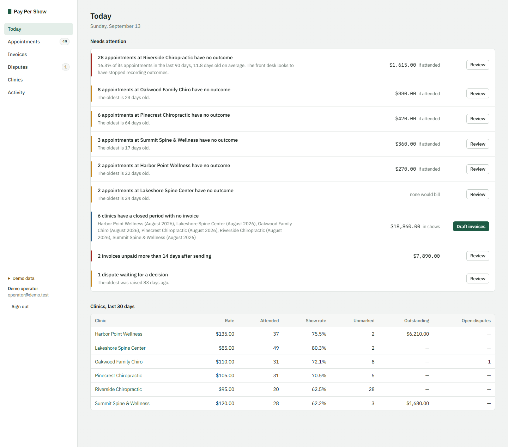
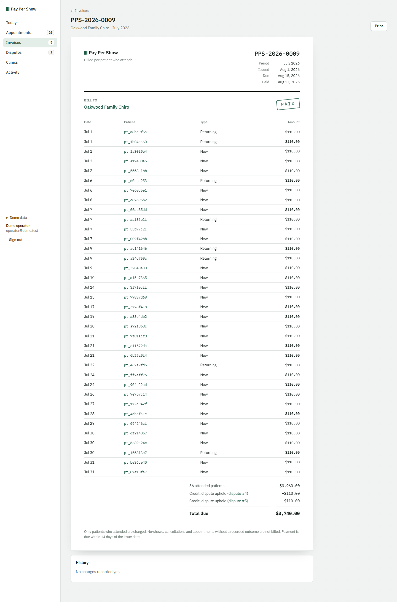
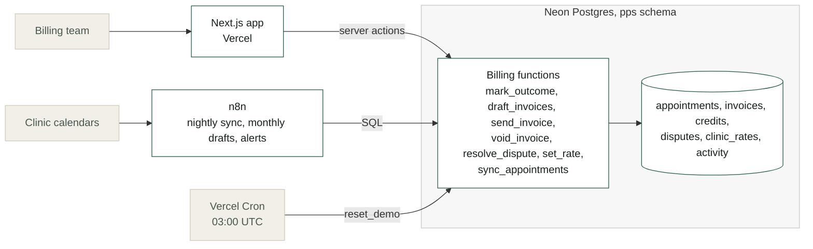

# Pay Per Show

Billing operations for an agency that charges clinics per patient who attends.
A Postgres billing core, a Next.js app for the billing team, and n8n workflows
for the scheduled work.

[](https://neon.tech)
[](https://nextjs.org)
[](https://n8n.io)
[](db/test.mjs)
[](LICENSE)

**[pay-per-show.vercel.app](https://pay-per-show.vercel.app)**. The sign-in page
shows a demo account. The clinics and figures are synthetic, shared by everyone
using the demo, and rebuilt every night.



## What the billing team does in it

| Page | Use |
|---|---|
| Today | What needs doing: clinics with appointments nobody marked and what they would bill, closed periods with no invoice, drafts to send, overdue invoices, open disputes |
| Appointments | Filter by clinic, outcome, billing state and date, and mark outcomes in bulk |
| Invoices | Draft closed periods, send, record payment, void with a reason. Each invoice is a printable document |
| Disputes | The evidence as it stood when the dispute was raised, and what each decision would do to that show before you choose |
| Clinics | Contract terms, rate history, credits and invoices |
| Activity | Every billing change, who made it and when |



## How it fits together



Every change to billing state is a Postgres function. The app's buttons and the
n8n workflows call the same functions, so each rule exists once, each change is
a single transaction, and each writes its own activity entry. The app never
updates a billing table directly.

## Billing rules

- A show bills at the rate in force on its own date, in the clinic's timezone,
  and the rate is frozen when the show becomes billable.
- A draft includes billable shows from earlier periods, so an appointment marked
  attended weeks late is still billed.
- Credits come off after the contract minimum, so a clinic under its minimum
  still receives them. Unused credit carries to the next invoice.
- A sent invoice never changes. Corrections go through a dispute and become a
  credit on a later invoice.
- The calendar sync never overwrites an outcome set by a person or a dispute.

The full rules, including each dispute outcome, are in
[`docs/reconciliation.md`](docs/reconciliation.md).

## Problems fixed in this version

The first version kept its billing logic in n8n SQL. Moving it into tested
functions turned up these:

| Problem | Effect | Fix |
|---|---|---|
| Invoices collected only shows dated inside the period | A show marked attended after its month was invoiced was never billed | Drafts include every billable show up to the period end |
| The nightly sync wrote the calendar's outcome over every row | A correction made by hand was undone overnight | Outcomes set by a person or a dispute are never overwritten |
| The sync read only the first clinic's bookings | Every other clinic was silently left out | The sync step runs once per clinic |
| The rate was frozen when the nightly job processed a show | Marking a show late, after a price change, billed the new price | Rate history; the rate on the appointment's date applies |
| Invoice months were taken in UTC | Evening appointments on the last day of the month in Los Angeles landed on the next month's invoice | Periods use the clinic's local date |
| One column was documented as dispute credits and used as the minimum top-up | Credits were never implemented | Separate top-up and credit amounts, with a record of each credit applied |

## Sign-in and the demo

- Passwords are hashed with scrypt from Node's standard library. The session
  cookie holds a random token; the database stores only its SHA-256 hash.
- Every page and every server action checks the session against the database.
  The middleware only redirects early.
- Failed sign-ins are limited per network and per email on that network, never
  per email alone, so nobody can lock another person out.
- Errors raised by a billing rule are shown to the user as written. Anything
  else is logged on the server and shown as a generic failure.
- The demo account is printed on the sign-in page. `pps.reset_demo()` rebuilds
  the demo clinics nightly through Vercel Cron, and on request from the sidebar.
  It only touches clinics whose id starts with `demo_`.

## Run it

```bash
cd dashboard
npm install
cp .env.example .env.local        # set DATABASE_URL
npm run migrate -- --seed         # tables, functions and demo data
npm run create-user -- you@example.com "Your name" "a long password"
npm run dev
```

## Tests

```bash
npm install
npm test
```

37 checks against an in-process Postgres (PGlite): rates and timezones, late
additions, minimums and credits, voiding, each dispute outcome, the calendar
sync, and the demo reset.

## n8n workflows

| Workflow | Calls |
|---|---|
| `01-nightly-outcome-sync` | `pps.sync_appointments`, once per active clinic |
| `02-unmarked-alert` | `pps.v_unmarked`, flagging the same 8% share and 7-day age as Today |
| `03-invoice-generation` | `pps.draft_invoices`, then posts the drafts for review |

Import them and add a Postgres credential named `Postgres account`. They read
the calendar URL and Slack webhook from `$env`, which n8n Cloud does not
support; on Cloud, put those values in the nodes directly.

## Layout

| Path | |
|---|---|
| `db/schema.sql` | Tables, billing functions and the unmarked view |
| `db/demo.sql` | Demo data, built by calling the billing functions |
| `db/test.mjs` | The 37 checks |
| `dashboard/` | Next.js app |
| `n8n/` | The three workflows |
| `docs/reconciliation.md` | Billing rules in full |

## Related

[`frontdesk`](https://github.com/maqbuuul/frontdesk) books the appointment.
[`ghl-provisioner`](https://github.com/maqbuuul/ghl-provisioner) sets up the
clinic's account. This bills for the patients who attended.

---

Built by [Abdiwahid Ali](https://github.com/maqbuuul). Nairobi.
