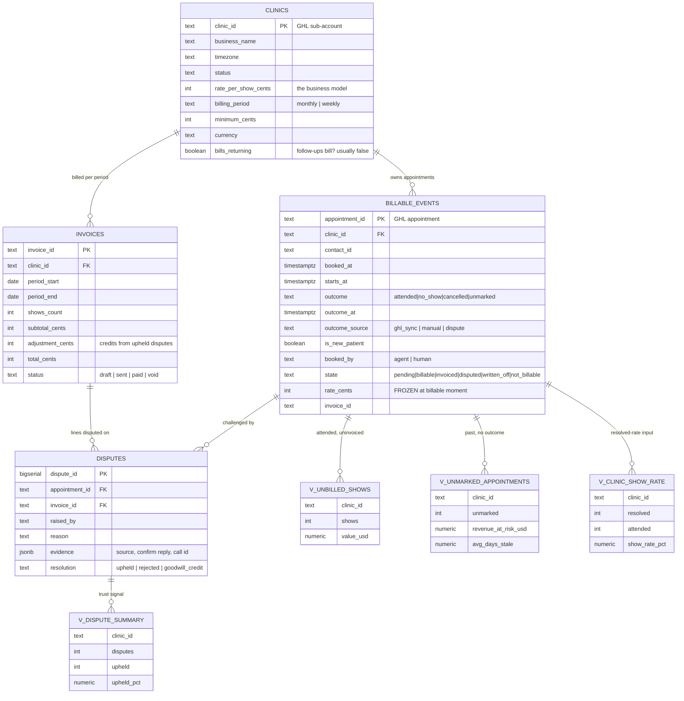

# Pay Per Show — Billing Reconciliation for Agencies Paid on Attendance

The billing engine for an agency that takes **$0 until a patient walks in**. It proves who showed up, freezes the rate so history can't be rewritten, and surfaces the appointments nobody marked — which under pay-per-show is revenue never invoiced.

**Stack:** Postgres (Neon) · n8n · Next.js read-only dashboard · Vercel

> 🔗 **Live dashboard:** [paste Vercel URL here]
> 🎥 **Demo video:** [paste Loom URL here — n8n run finding the $1,520, used in Conek tech application]

---

## 1. The problem

If you bill per patient who shows up, somebody has to prove who showed up. At five clinics that's a spreadsheet. At five hundred it's a full-time job nobody has — and it fails silently in three directions:

- **Appointments nobody marked.** Not a no-show — missing data. Under pay-per-show that's revenue you never invoiced.
- **Disputes you can't answer.** "That patient never came," six weeks later. What's the evidence?
- **Rates that moved.** You raised a clinic in March; a June reprint must still show March's number.

None of these throw an error. They just quietly cost money.

---

## 2. The view that finds money

```sql
SELECT * FROM v_unmarked_appointments;
```

Appointments whose time passed that nobody ever marked attended or no-show — with the revenue attached:

```
 clinic_id | business_name       | unmarked | revenue_at_risk_usd | avg_days_stale
-----------+---------------------+----------+---------------------+----------------
 riverside | Riverside Chiro     |       16 |             1520.00 |           10.0
```

Two different problems produce that row and both need chasing: the front desk stopped recording (you're under-billing), or nobody is checking (every downstream number is rotting). **Run this first against any real account — it's usually not zero.**

---

## 3. Three rules, enforced in the schema

1. **`unmarked` is a state, not an absence.** Collapsing it into no-show makes show rate look worse, revenue look smaller, and hides that somebody stopped filling in a field.
2. **The rate is copied onto the event when it becomes billable, never re-read at invoice time.** Re-deriving from today's rate card silently rewrites history — and the first time a clinic notices, every invoice you've sent becomes questionable.
3. **Cancelled is not no-show.** A patient who cancelled in advance didn't fail to attend. Conflating them makes show rate useless for the conversation it exists to support.

---

## 4. Database (ERD)

`billable_events` rows are created **at booking time, not attendance time** — so appointments with no outcome are visible rather than absent. A show is never deleted, only moved through states.



Schema: [`db/schema.sql`](db/schema.sql) · demo history: [`db/seed.sql`](db/seed.sql) (90 deterministic days, faults planted: Riverside's 16 unmarked / $1,520, Summit's 44% show rate vs 69–81% elsewhere, Oakwood's 3 disputes) · rule tests: [`db/verify.mjs`](db/verify.mjs)

---

## 5. Project map

```
db/schema.sql      clinics, billable_events, invoices, disputes + 4 views
db/seed.sql        90 days demo history with planted faults
db/verify.mjs      10 assertions over money rules (PGlite, no DB needed)
n8n/               3 workflows (import into stock n8n):
  01-nightly-outcome-sync   mirror GHL outcomes → billable_events
  02-unmarked-alert          find revenue at risk → Slack before it ages out
  03-invoice-generation      freeze rates → invoice lines per clinic per period
dashboard/         Next.js read-only screen (see §7) — deploys to Vercel
docs/              reconciliation rules + dispute handling
```

### n8n setup

One Postgres credential named exactly **`Postgres account`**, instance env `GHL_AGENCY_TOKEN` (or point `01` at your real calendar API), `SLACK_WEBHOOK_URL`, `UNMARKED_ALERT_HOURS`. Import the three JSONs, run `02-unmarked-alert` manually — expect Riverside's $1,520. (On n8n Cloud, paste the Slack URL directly into the node; `$env` is restricted there.)

---

## 6. Run & verify

```bash
psql "$DATABASE_URL" -f db/schema.sql
psql "$DATABASE_URL" -f db/seed.sql
npm install && npm run verify   # 10/10, no database needed
cd dashboard && npm install && npm run dev
```

```sql
-- the three queries that matter
SELECT * FROM v_unmarked_appointments;
SELECT * FROM v_unbilled_shows;
SELECT * FROM v_clinic_show_rate;
```

---

## 7. Dashboard — deploy to Vercel ⚠️ root directory note

The dashboard is a **separate Next.js app in `dashboard/`**. When importing to Vercel set **Root Directory = `dashboard`** or the build fails. One env var: `DATABASE_URL`. Nothing else.

What it shows: four tiles (ready-to-invoice, unmarked, quiet clinics, open disputes) + tables for unmarked appointments (red-flagged when a clinic averages 7+ days without recording — *"front desk has stopped recording"*), ready-to-invoice, show rate (<55% flagged with diagnosis, not just number), open disputes. Read-only by design (`force-dynamic`, no cache — a cached billing figure gets quoted wrong to a client), tabular numerals, light+dark.

Details: [`dashboard/README.md`](dashboard/README.md)

---

## 8. Where this sits

[`../frontdesk`](../frontdesk) books the appointment → [`../ghl-provisioner`](../ghl-provisioner) builds the account and the show-up workflows → **this** proves they turned up, which is the only event that produces an invoice. Built for the **Conek tech** application: the n8n run + this dashboard are the "cost per attended appointment" evidence.

---

Built by [Abdiwahid Ali](https://github.com/maqbuuul). Nairobi.
