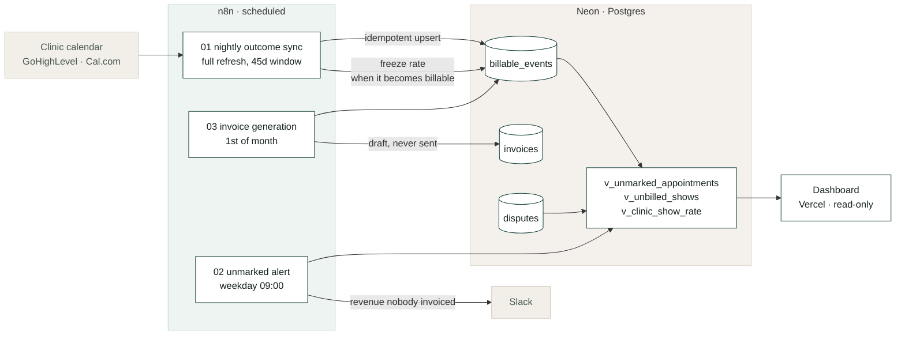

# Pay Per Show

**Reconciles attended appointments into billable shows — the billing engine for
an agency that takes $0 until a patient walks in.**

[](https://neon.tech)
[](https://n8n.io)
[](https://nextjs.org)
[](https://typescriptlang.org)
[](https://pay-per-show.vercel.app)
[](db/verify.mjs)
[](LICENSE)

**→ [pay-per-show.vercel.app](https://pay-per-show.vercel.app)**


---

## The problem

If you bill per patient who shows up, somebody has to prove who showed up.

At five clinics that's a spreadsheet. At five hundred it's a full-time job
nobody has, and it fails in three directions at once — none of which throws an
error:

- **Appointments nobody marked.** Not a no-show. Missing data. Under
  pay-per-show that is revenue never invoiced
- **Disputes you can't answer.** A clinic says "that patient never came." Six
  weeks later, what's the evidence?
- **Rates that moved.** You raised a clinic's rate in March. An invoice
  regenerated in June must still show March's number

## Architecture



## The view that finds money

```sql
SELECT * FROM v_unmarked_appointments;
```

```
 business_name              | unmarked | revenue_at_risk_usd | unmarked_pct | avg_days_stale
----------------------------+----------+---------------------+--------------+----------------
 Riverside Chiropractic     |       15 |             1425.00 |          8.8 |           10.3
 Summit Spine & Wellness    |        5 |              600.00 |          2.7 |           14.2
 Pinecrest Chiropractic     |        4 |              420.00 |          2.2 |           11.3
 Oakwood Family Chiro       |        3 |              330.00 |          1.9 |           16.9
```

Two very different problems produce that top row, and both need chasing:

1. The front desk stopped recording attendance → the agency is under-billing
2. Nobody is checking → the data every other number depends on is rotting

**`unmarked_pct` is the column that does the work.** Every front desk leaves a
few stragglers, so a raw count just ranks clinics by size, and an average age
just finds whoever has the oldest single straggler — Oakwood is the *stalest*
here at 16.9 days on three appointments, and nothing is wrong with Oakwood.

A desk that has actually stopped recording leaves a hole, and a hole shows up
as a share: Riverside at 8.8% against 2.7% and below everywhere else. The
dashboard flags on that, plus an age floor, so exactly one row lights up. A
dashboard that flags every client has told you nothing.

**Run this first against any real account.** The number it returns is usually
not zero.

## Three rules, enforced in the schema

**`unmarked` is a state, not an absence.** An appointment nobody marked is not a
no-show. Collapsing the two makes show rate look worse and revenue look smaller,
and hides the actual problem — that somebody stopped filling in a field.

**The rate is copied onto the event, never re-read at invoice time.** Rates
change. An invoice must be reproducible a year later; re-deriving it from
today's rate card silently rewrites history, and the first time a clinic notices,
every invoice you have ever sent becomes questionable.

**Cancelled is not no-show.** A patient who cancelled in advance did not fail to
attend. Conflating them makes show rate useless for the conversation it exists
to support.

## Nothing is automatic

**The unmarked alert never auto-marks.** Guessing an outcome to clear an alert is
how a billing system starts inventing revenue.

**Invoices are generated as drafts, never sent.** An invoice is a claim on
somebody's money. The system prepares it; a person sends it.

**The nightly sync never walks an invoiced line backwards.** A re-sync cannot
rewrite an invoice you have already issued.

## Run it

```bash
psql "$DATABASE_URL" -f db/schema.sql
psql "$DATABASE_URL" -f db/seed.sql        # 90 days of demo history

cd dashboard && npm install && npm run dev
```

Import the three workflows from `n8n/` and add one Postgres credential named
exactly `Postgres account`.

The seed plants what a real account looks like after a quiet quarter:

| Clinic | What the workflows find |
|---|---|
| **Riverside** | ~15 appointments nobody marked, **~$1,425 not invoiced**, averaging 10 days old and concentrated in one stretch — a front desk that stopped recording on a particular day |
| **Summit** | ~45% show rate against 71–80% everywhere else |
| **Oakwood** | Three disputes from one week, two upheld |

The seed is anchored on `current_date`, so it always produces a realistic
*recent* quarter rather than a fixed range that ages into irrelevance. The
faults are deterministic; the exact counts move by a few either way depending
on which weekday you load it.

## Verify

```bash
npm install && npm run verify
```

Ten assertions over the billing rules, in an in-process Postgres. No database
required.

```
PASS  returning patients excluded when the contract says so
PASS  future appointments are not counted as unmarked
PASS  show rate counts only resolved outcomes
PASS  a rate change does not rewrite already-billable history
```

These are money rules. They should fail loudly the moment somebody changes a
definition, which is what this test is for.

## Layout

| Path | |
|---|---|
| `db/schema.sql` | 4 tables, 4 views |
| `db/seed.sql` | 90 days across 6 clinics, deterministic, faults planted |
| `db/verify.mjs` | The ten assertions |
| `n8n/` | Nightly sync, unmarked alert, invoice generation |
| `dashboard/` | Read-only Next.js on Vercel — `DATABASE_URL`, plus optional `AGENCY_TZ` |
| `docs/reconciliation.md` | What bills, what doesn't, how disputes resolve |

## Where this sits

[`frontdesk`](https://github.com/maqbuuul/frontdesk) books the appointment.
[`ghl-provisioner`](https://github.com/maqbuuul/ghl-provisioner) builds the
account and the workflows that get the patient to turn up.

This proves they turned up — the only event that produces an invoice.

---

Built by [Abdiwahid Ali](https://github.com/maqbuuul). Nairobi.
