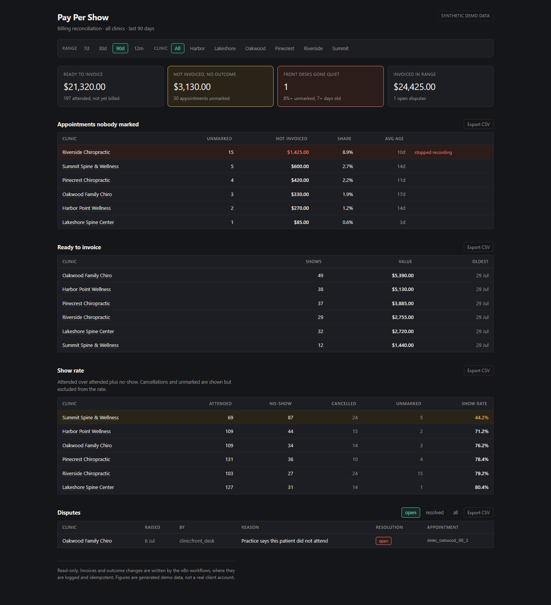
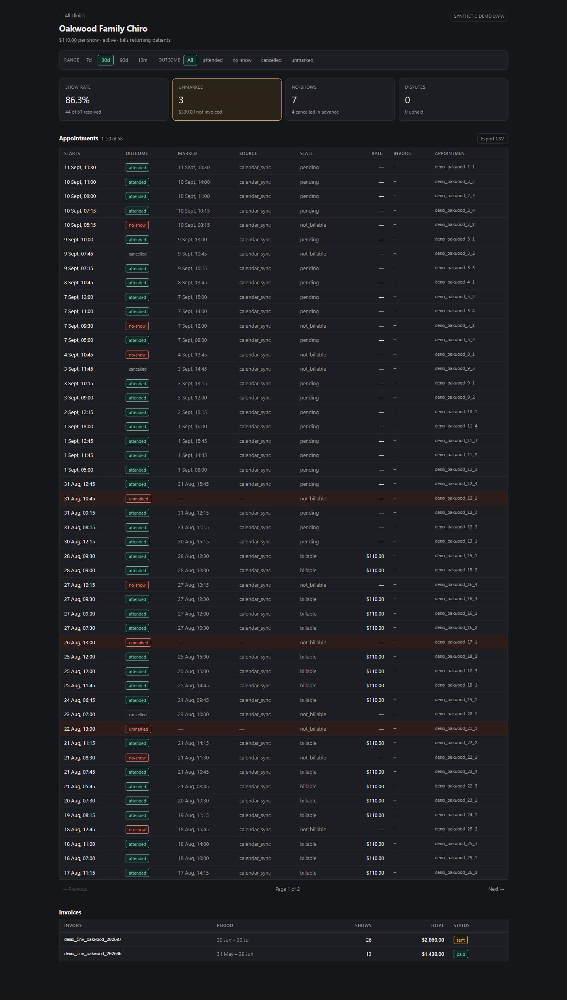

# Pay Per Show

Billing reconciliation for an agency that charges per patient who attends.
Postgres schema, three n8n workflows, and a read-only Next.js dashboard.

[](https://neon.tech)
[](https://n8n.io)
[](https://nextjs.org)
[](db/verify.mjs)
[](LICENSE)

**[pay-per-show.vercel.app](https://pay-per-show.vercel.app)** — runs on
synthetic seed data, not a real client account.



Drill down into a clinic for its individual appointments, invoices and disputes:



## What it does

If you bill per attendance, you have to be able to prove attendance. This
tracks appointments through outcome states, freezes the rate when a show
becomes billable, generates draft invoices, and reports what is missing.

The dashboard supports date ranges (7/30/90/365 days), per-clinic filtering,
column sorting, drill-down into a clinic's individual appointments with
pagination, and CSV export of any table.

## Data model

Four tables: `clinics`, `billable_events`, `invoices`, `disputes`.

| Rule | Where it lives |
|---|---|
| A show moves through states and is never deleted | `billable_events.state` |
| The rate is copied onto the event when it becomes billable, never re-read at invoice time | `billable_events.rate_cents` |
| `unmarked` is a state, not an absence, and is not a no-show | `billable_events.outcome` |
| Cancelled is excluded from show rate, not counted as a failure | `v_clinic_show_rate` |

Rates change. Copying the rate onto the event keeps an invoice reproducible a
year later; re-deriving it from the current rate card rewrites history silently.

## Finding a front desk that stopped recording

`v_unmarked_appointments` reports unmarked appointments per clinic, with
`unmarked_pct` — unmarked as a share of that clinic's own past appointments.

```
 business_name              | unmarked | revenue_at_risk_usd | unmarked_pct | avg_days_stale
----------------------------+----------+---------------------+--------------+----------------
 Riverside Chiropractic     |       15 |             1425.00 |          8.8 |           10.3
 Summit Spine & Wellness    |        5 |              600.00 |          2.7 |           14.2
 Pinecrest Chiropractic     |        4 |              420.00 |          2.2 |           11.3
 Oakwood Family Chiro       |        3 |              330.00 |          1.9 |           16.9
```

The share is the column that matters. A raw count ranks clinics by size, and
average age just finds whoever has the oldest straggler — Oakwood is stalest
here at 16.9 days and nothing is wrong with it. The dashboard flags on
`unmarked_pct >= 8` plus a 7-day age floor, which selects one row. The n8n
alert applies the same two thresholds, so the two cannot disagree.

## What is never automatic

- The unmarked alert does not auto-mark. Guessing an outcome to clear an alert
  invents revenue.
- Invoices generate as drafts. A person sends them.
- The nightly sync will not move a line that is already invoiced.

## Disputes

`disputes.evidence` captures what the appointment looked like when it was
marked: who booked it, which sync set the outcome, and when. The clinic
drill-down renders it inline, so a dispute raised weeks later can be answered
without opening another system.

## Run it

```bash
psql "$DATABASE_URL" -f db/schema.sql
psql "$DATABASE_URL" -f db/seed.sql

cd dashboard && npm install && npm run dev
```

`dashboard/.env.example` lists the variables. `DATABASE_URL` is required;
`AGENCY_TZ` is optional and defaults to `America/New_York`.

Import the three workflows from `n8n/` and add one Postgres credential named
`Postgres account`.

## Seed data

Synthetic, deterministic, idempotent — it only touches ids prefixed `demo_`.
Anchored on `current_date`, so it always produces a recent quarter; exact
counts shift by a few depending on which weekday you load it.

| Clinic | Planted fault |
|---|---|
| Riverside | ~15 unmarked, ~$1,425, clustered in one stretch |
| Summit | show rate in the 40s against 70–80% elsewhere |
| Oakwood | 3 disputes in one week, 2 upheld |

## Tests

```bash
npm install && npm run verify
```

Ten assertions over the billing rules, run against an in-process Postgres
(PGlite). No database required.

```
PASS  returning patients excluded when the contract says so
PASS  future appointments are not counted as unmarked
PASS  show rate counts only resolved outcomes
PASS  a rate change does not rewrite already-billable history
```

## Layout

| Path | |
|---|---|
| `db/schema.sql` | 4 tables, 4 views |
| `db/seed.sql` | 90 days across 6 clinics |
| `db/verify.mjs` | The ten assertions |
| `n8n/` | Nightly sync, unmarked alert, invoice generation |
| `dashboard/` | Next.js, read-only |
| `docs/reconciliation.md` | What bills, what doesn't, how disputes resolve |

## Related

[`frontdesk`](https://github.com/maqbuuul/frontdesk) books the appointment.
[`ghl-provisioner`](https://github.com/maqbuuul/ghl-provisioner) builds the
account. This bills for the ones who attended.

---

Built by [Abdiwahid Ali](https://github.com/maqbuuul). Nairobi.
